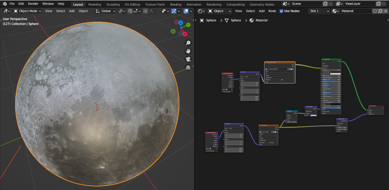

# 3D Moon model in Blender based on NASA maps with Apple-AR export

## Quick start for Apple AR

Simply store the a `.usdz` on a Mac or iPhone/iPad. `Moon_ani.usdz` is a 
3D model of the moon that slowly rotates in AR, `Moon.usdz` is a static 3D
model.

When opening on an iOS device, the moon can be placed in the surrounding
with iOS's AR functionality.

Note: This model big: You might need to pinch zoom back to see the surface.

## Generate your own version with Blender

* Install the [USDZ Export/Import tool for blender](https://github.com/robmcrosby/BlenderUSDZ), if you want to
export for use with Apple AR on iOS devices. (Not needed to work only with Blender)
* Download the [surface texture](https://svs.gsfc.nasa.gov/vis/a000000/a004700/a004720/lroc_color_poles.tif) and [height map](https://svs.gsfc.nasa.gov/vis/a000000/a004700/a004720/ldem_64.tif) from NASA's Scientific Visualization Studio (see reference below)
  Store both texture with filenames `lroc_color_poles.tif` (image texture) and `ldem_64.tif` (height map) in the directory of `Moon.blend`.
* Open the `moon.blend` file. To test the animation press `SPACE`.
* Export the 3D model als Apple AR compatible model With `File / Export / USDZ` 
(the above plugin needs to be installed and enabled for this option to exist). Select to export materials
and bake the textures. Resolution can be changed from 1024 to 2048 or 4096. Tick 'animation', if the model
should rotate.

## References

### NASA Scientific Visualisation Studio's image textures

[NASA's Scientific Visualization Studio](https://svs.gsfc.nasa.gov/cgi-bin/details.cgi?aid=4720)

CGI Moon Kit, Visualizations by Ernie Wright

Sources for map and displacement:

The hightest-resolution texture maps are at:

* [Moon surface](https://svs.gsfc.nasa.gov/vis/a000000/a004700/a004720/lroc_color_poles.tif) (518MB)
* [Moon height map](https://svs.gsfc.nasa.gov/vis/a000000/a004700/a004720/ldem_64.tif) (1.06GB)

Store the downloads in the same directory with the `.blend` file.

### USDZ export tool

* <https://github.com/robmcrosby/BlenderUSDZ> by Robert Crosby.

